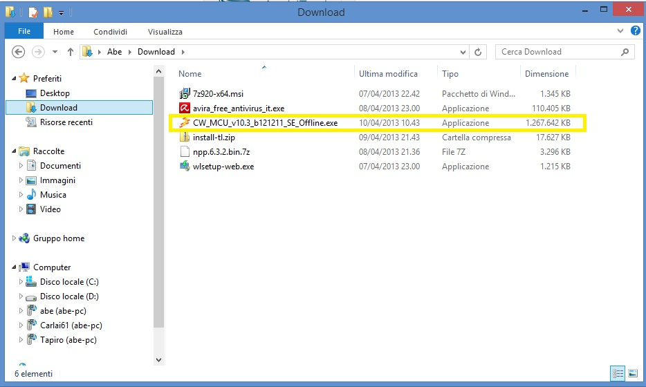
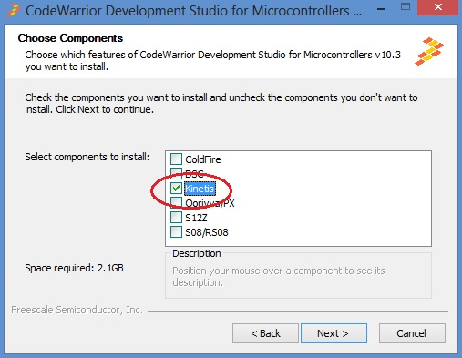
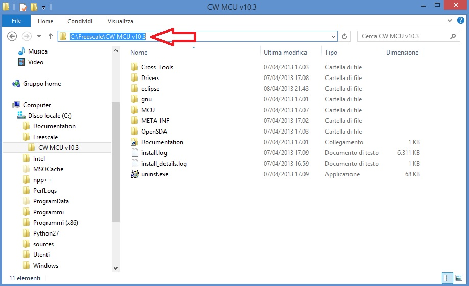
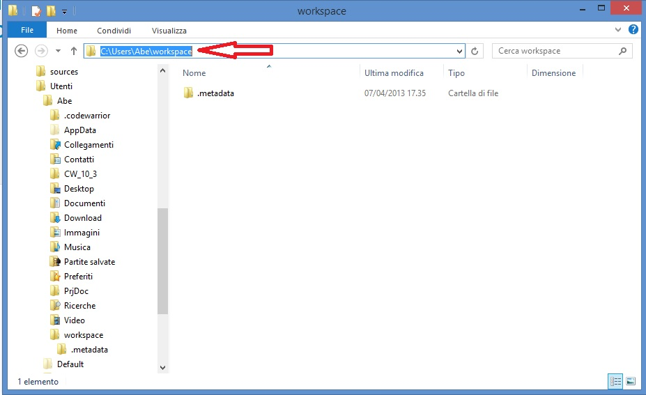
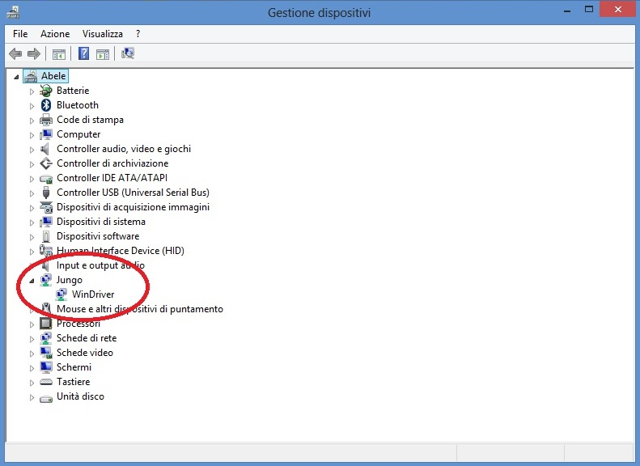
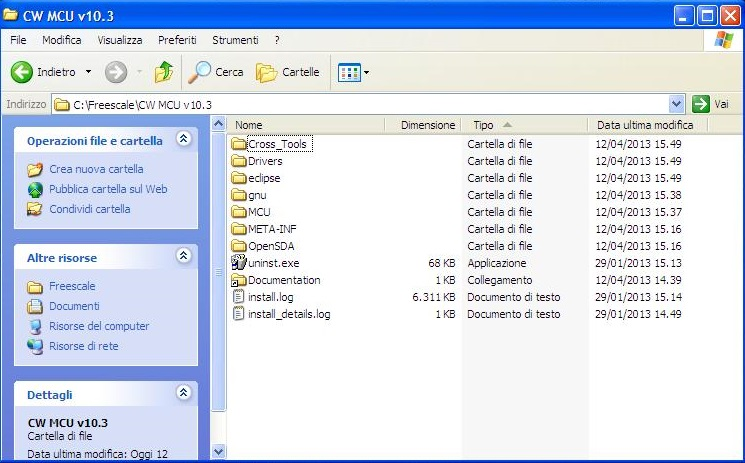
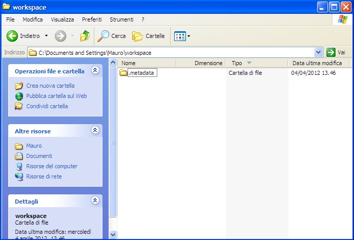
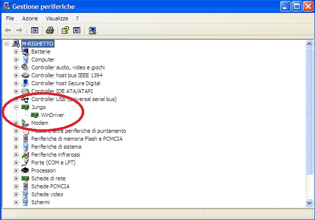

.. index:: CwInst

Installing Codewarrior on WIN7 or WIN8
**************************************

Double click on 'CW_MCU_v10.3_b121211_SE_Offline.exe' that you have downloded first, and follow installation istruction.

**Quick start guide for Codewarrior install can be found at** http://cache.freescale.com/files/soft_dev_tools/doc/quick_ref_guide/MCU_QS.pdf?fpsp=1

When setup ask for MCU type, select almost Kinetis as show below, then press NEXT button

If you have Windows7 or Windows8 (32 or 64 bit) Codewarrior will install into "Freescale\\CW MCU v10.3" folder on the root of your system HDD.

and create a default work folder named **workspace** in the path **C:\\Users\\** *your_user_name* **\\workspace**

| make sure that setup have been installed Jungo Driver. See your system configuration (righ-click on Computer --> Properties --> Device Manager)
| if you have any troubles about, read Codewarrior install Guide

Codewarrior on WINXP
--------------------
For WinXP, after installation, you have:

- installation folder

- default work folder

- Jungo driver:

