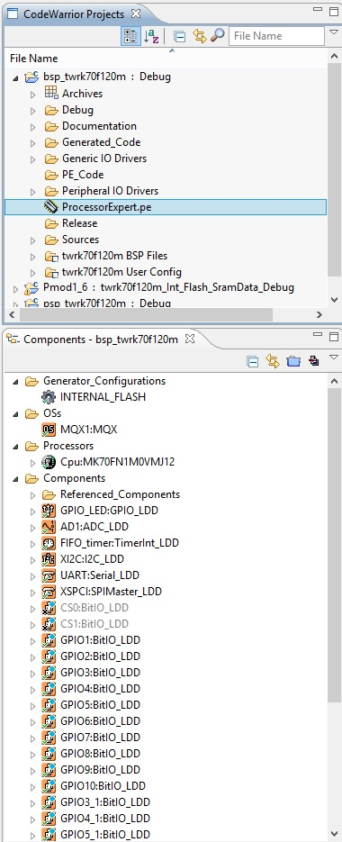
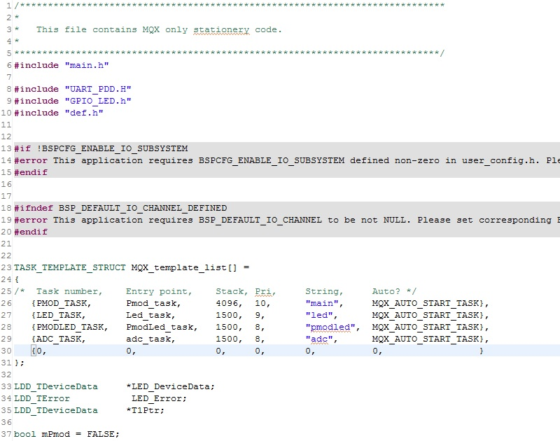

.. index:: MaxFiles

Firmware details
****************

Brookling Board firmware comes from original Maxim Maxim Zenboard Platform project revision 1.6, by using the file listed below.

Main project files from Maxim
-----------------------------

- MaximPmod.c
- menu.c.
- maximDeviceSpecificUtilities.c
- platform.c
- utilities.c

and related include files

- MaximPmod.h
- menu.h
- maximDeviceSpecificUtilities.h
- platform.h
- utilities.h
- platform_config.h

You can find all this file in the "Source" folder of the project

General include files
---------------------

- xbasic_types.h
- xgpio.h
- xgpio_l.h
- xiic_l.h
- xil_assert.h
- xil_cache.h
- xil_io.h
- xil_types.h
- xparameters.h
- xparameters_ps.h
- xpseudo_asm.h
- xpseudo_asm_gcc.h
- xpseudo_asm_rctv.h
- xreg_cortex9.h
- xspi.h
- xspi_i.h
- xspi_l.h
- xstatus.h
- xuartlite.h
- xuartlite_i.h
- xuartlite_l.h
- xuartps_hw.h

You can find all this file in the "Source\\x_files" folder of the project

.. image:: _static/x_files.jpg

Main Project files added
------------------------

In source folder you find application specific files:

- main.c  (MQX main function including task declaration and function)
- C_Events.c (ISR events function)
- driver.c (low-level function replacement)

and include files

- main.h (MQX main include)
- MaxFuncRedefinition.h (start menu function redifinition)
- def.h (general purpose definition)

This project is developed under Codewarrior 10.3 using **Processor Expert tools**. In the BSP  project you can find folder "Generated_Code" witch contains files generated by Processor Expert.
Opening BSP project you can see Processor Expert settings. It's strongly recommended to make no changes in the configurations of the Processor Expert components, because of some adjustement needed in file after code generation. A detail of this changes is available on request.

MQX tasks brief
---------------

| In file main.c there are 4 tasks:
| **Pmod_task**: invokes init timer and main_pmod() 
| **Led_task**: yellow led blink (on tower cpu board)
| **PmodLed_task**: orange led blink during Pmod_task active
| **adc_task**: a task that read from ADC converter the value of potentiometer R52 and start/stop blue led blink.

