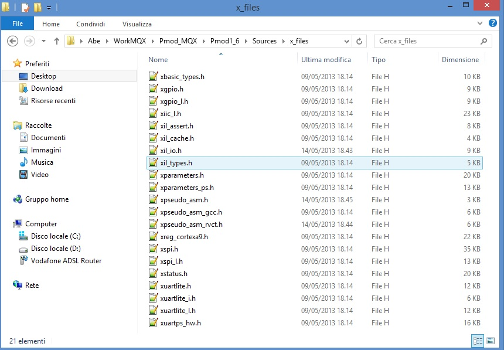

.. index:: MaxFiles

Firmware details
****************

Brookling Board firmware comes from original Maxim Maxim Zenboard Platform project revision 1.6, by using the file listed above.

Main project files from Maxim
-----------------------------

- MaximPmod.c
- menu.c.
- maximDeviceSpecificUtilities.c
- platform.c
- utilities.c

and related include files

- MaximPmod.h
- menu.h
- maximDeviceSpecificUtilities.h
- platform.h
- utilities.h
- platform_config.h

You can find all this file in the "Source" folder of the project

General include files
---------------------

- xbasic_types.h
- xgpio.h
- xgpio_l.h
- xiic_l.h
- xil_assert.h
- xil_cache.h
- xil_io.h
- xil_types.h
- xparameters.h
- xparameters_ps.h
- xpseudo_asm.h
- xpseudo_asm_gcc.h
- xreg_cortex9.h
- xspi.h
- xspi_i.h
- xspi_l.h
- xstatus.h
- xuartlite.h
- xuartlite_i.h
- xuartlite_l.h
- xuartps_hw.h

You can find all this file in the "Source\\x_files" folder of the project

Main Project files added
------------------------

In source folder you find application specific files:

- ProcessorEspert.c  (containing Main())
- Events.c
- driver.c (low-level function replacement)

and include files

- MaxFuncRedefinition.h (start menu function redifinition)
- Events.h

| This project is developed under Codewarrior 10.3 using Processor Expert tools. You can also find two folders, one named "Generated_Code" and second named "PE_code"
| The first one contain auto-generated file that depend on Logical Device component inside Processor Expert Components, and may rebuild each occurence (when a device settings modification has been made)
| The second contains file one-time generated by Processor Expert and "freezed" in this folder. No modification can be invoked by Processor Expert.

.. image:: _static/CW_prj.jpg

Detailed documentation of firmware can be downloaded ..... link
