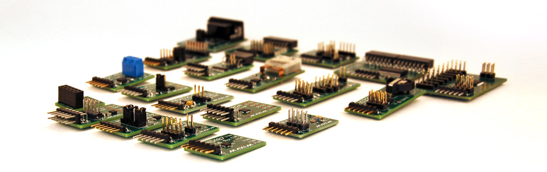
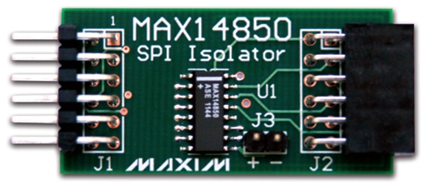
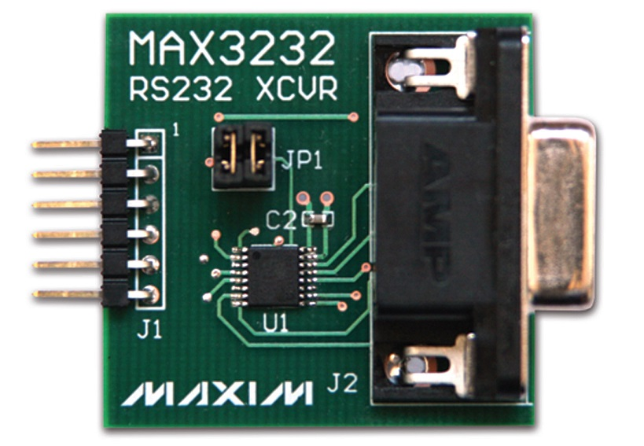

More about Pmod
***************

Maxim Analog Essential Collection is a collection of plug-in peripheral modules (Pmod)
You can find more informations visiting `Maxim Analog Essential Collection <http://www.maximintegrated.com/app-notes/index.mvp/id/5468>`_ site

Important notice
----------------
**At the date of issue of this review, Maxim Zenboard Platform Project files are available on version 1.6, and don't support MAX14850 Pmod module. 
As a result this version, that use original files from Maxim project, is not able to emulate this device.**

Emulation of MAX3232
--------------------

This device is a RS232 converter, and require 2 serial channel (each one connected to terminal software) for full test.
The first one is used for commands and the second one must be connected, for complete testing purpose, to MAX3232 Pmod serial connector (by standard modem cable).

