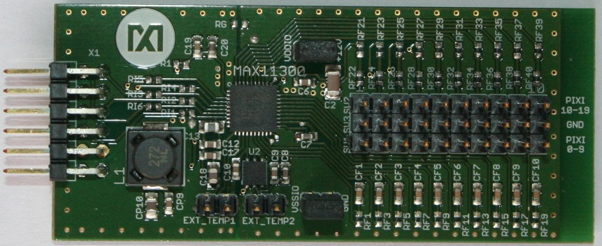

.. Brooklyn Board by Silica Architech  documentation master file, created by
   sphinx-quickstart on Wed Apr 10 11:13:41 2013.
   You can adapt this file completely to your liking, but it should at least
   contain the root `toctree` directive.

Welcome to Brooklyn Board by Silica Architech 's documentation!
===============================================================

:Version: 2.0.0 release v2
:Date: july 24,2014
:Copyright: (C)2016 by Avnet Silica company

.. image:: _static/freescale.jpg
.. image:: _static/maxim.jpg

| Silica Brooklyn Board is useful system to evaluate MAXIM Pmod device and is designed for use with Freescale TWR-K70F120M tower system. This software release is working on Kinetis K70 devices but not under MQX rtos.

| You can find and download TWR-K70 documentation by clicking:

http://www.freescale.com/webapp/sps/site/prod_summary.jsp?code=TWR-K70F120M&tid=m32TWR

**Developement software used is CodeWarrior MCU v10.3 Special Edition.**

| This application is free downlodable from Freescale site. To download it, `click here 
 <http://www.freescale.com/search?proxystylesheet=search_style_fe&sort=date:D:L:d1&oe=UTF-8&ie=UTF-8&ud=1&output=xml_no_dtd&callback=ss_show&lang_cd=en&filter=0&getfields=*&baseUrl=http://www.freescale.com/webapp&SEARCH_OPERATOR=Contains&attempt=-1&rc=1&hl=en&wc=200&wc_mc=1&exclude_apps=1&site=fsl_en&ulang=en&ip=151.20.83.230&access=p&entqr=3&entqrm=0&client=search_sw_tools&q=codewarrior+10.3+inmeta:Asset_Type%3DSoftwareTools+inmeta:type%3DSoftware%2520Development%2520Tools_IDE%2520%252D%2520Debug%252C%2520Compile%2520and%2520Build%2520Tools&dnavs=inmeta:Asset_Type%3DSoftwareTools+inmeta:type%3DSoftware%2520Development%2520Tools_IDE%2520%252D%2520Debug%252C%2520Compile%2520and%2520Build%2520Tools&start=10>`_  and select "Special Edition: CodeWarrior for Microcontrollers 10.3 (Eclipse, Offline) (REV 10.3)" package. (note that download can take much time ...)

**New release v2: MAX11300 "Pixi" added!!!**
---------------------------------------------

**The new release v2 is able to evaluate MAX11300 PIXI, 20-Port Programmable Mixed-Signal I/O with 12-Bit ADC, 12-Bit DAC, Analog Switches, and GPIO. Full description of Pmod Pixi's functions loking at specific chapter. For installation and configuration you can use same intructions as you can find in chapter** *"Installing Codewarrior on WIN7 or WIN8"* **and** *"Quick Start Guide"*

| We suggest you to read the Quick Start Guide to setup your evaluation system

:ref:`quick`

This guide explains how to use this application and provides an overview of on the structure of the project firmware

.. toctree::
 :maxdepth: 2
   
 CwInst
 MaxFiles
 changes
 Using
 
.. toctree::
 pixi

.. toctree::
 :hidden:
 
 quick   

 
 
We also suggest you to see documentation `Maxim Pmod-Compatible Plug-In Peripheral Modules <http://www.maximintegrated.com/products/evkits/fpga-modules/>`_ for any specific further detail.

* :ref:`search`

