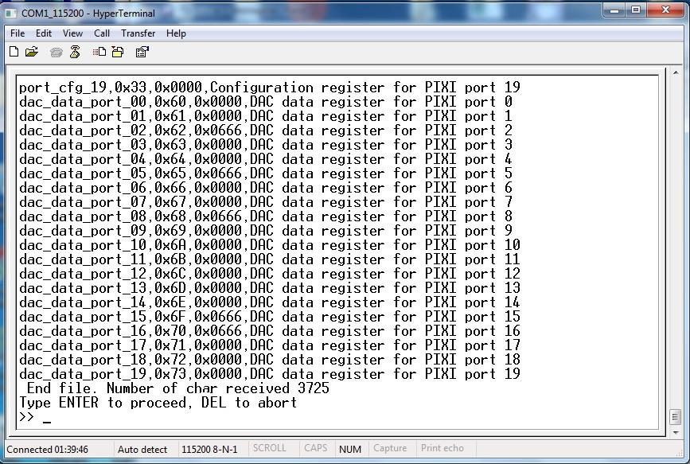

.. index:: Pixi

**"PIXI" MAX11300**
*******************

This guide will explain how can you work with MAX11300PMB1 Pmod Peripheral Module to evaluate the 'Pixi' performance.

| **Datasheet of MAX11300 device and MAX11300PMB1 Pmod module can be found at:**
| http://www.maximintegrated.com/en/pst/run.mvp?q=max11300
| 

First steps with Pixi
=====================

| Before starting with Pixi PMB1 Pmod board, first of all you must install *CodeWarrior MCU v10.3 Special Edition*. You must have on your PC terminal application software (such as HyperTerminal) and USB to serial converter. To evaluate Pixi performance use Freescale TWR-K70F120M tower system equipped with Brooklyn Board expansion board. For correct setup of your Hardware and Firmware environment, follow instruction inside chapters:

| :ref:`CwInst`
| :ref:`quick`
| 

.. important::

 **Download from** `"Silica Architec Site"  <http://www.silica.com/architech.html>`_  **under the section "Brooklyn Board" the latest Pmod Firmware (Pmod1_6_v2.zip) and follow installation and configuration instructions specified for Pmod1_6**

.. note::

 **Take care at project importer window on Codewarrior: you must import project named Pmod1_6_v2**
 
 .. image:: _static/pixi/pixi_prj.jpg
 
Setting your hardware
---------------------

The MAX11300PMB1 Pmod board must be inserted on CN5 connector of Brookling Expansion Board:

Now you are ready to evaluate Pixi! Enjoy!

Starting Pmod1_6_v2 firmware
----------------------------

When program starts, you can see the two following screens on your terminal:

and then, after about 3 seconds:

By typing "**X**" at terminal prompt, you can see **MAX11300 main menu** (figure below)

**Follow instruction on screen to perform basic read/write functions or reset device to power-up default**

Load and save configuration
===========================

Using this functions you can load a MAX11300 configuration file generated by the MAXIM PC application "**MAX11300 Configuration Software**". You can use "Generate register" function inside "File" menu from the Maxim PC application *(figure below)*
 

The MAXIM application will  store a ".csv" file format, that can be read by Pmod1_6_v2 and stored inside the MAX113000PMB1 evaluation board.

Load Configuration instructions
-------------------------------

At prompt of MAX11300 main menu, type "**5**" 

Now you can see on your terminal the message in figure below.

click on "**Transfer**" menu, select "**Send Text File**" and click over

navigate to your folder containing the MAX11300 register configuration file (an example file can be found in the Codewarrior project folder under documentation\\examples), select "**All Files**" in the pulldown menu *(red-circled)* and then select file (as example blue-signed).Click "Open" and file will be transferred.

When transfer ends, press "**ENTER**" to start programming device, "**END**" to abort

confirmation screen: hit ENTER to continue, END to abort

MAX11300 succesfull programmed!!

Save Configuration instructions
-------------------------------

At prompt of MAX11300 main menu, type "**6**" 

Take care at simple instruction on your terminal window (figure above) and remember it

click on "**Transfer**" menu, select "**Capture Text**" and click over

Ttype path and name of file that you will store (also using Browse button), then click "**Start**" and after hit **ENTER**

When transfer ends, click on "**Transfer**" menu, select "**Capture Text**" --> "**Stop**" and click over

Configuration file successfully saved. You can use this file with "Load Configuration" function to backup/restore your custom configuration.

Simple sequencer
================

In MAX11300 main menu you can find the function "**Run basic line command sequencer**". This a simple *step by step* sequencer that performs READ and WRITE of Pixi register. It can be used to dynamically check basic input/output sequences and see on terminal the result of each step. It is possible to activate one or more *loop* to retry up to 65535 times any step group defined during line command insertion. By typing "**8**" in main menu screen, you go to sequencer sub-menu.

In the Sequencer sub-menu there are two functions: 
| **Write sequencer steps** (*enter by typing* **1**)
| **Run program** (*enter by typing* **2**)

The first one is a wizard for entering sequencer steps. The second is the "launch" function that runs the program. If no program is written by user (using Write sequencer steps) the firmware will run the demo program. This demo program will perform a basic setting of port0 and generate port0 output as in figure below

Writing sequences
-----------------

When you enter in **Write sequencer steps** sub-menu, you can see the screen below:

Read simple help lines to understand how to write command line. In the figure above you can see one program example. Data will be accepted when you hit ENTER. By typing ENTER when the sequencer editor will wait for MODE, the program will be ended and stored inside program memory.

.. note::

 **maximum sequencer steps is 200. If you reached this number, the editor will automatically ends and stores the program.**
 

Hit ENTER when editor will wait for MODE. The program ends and will be stored.

.. note::

 *It is possible to create a file containing all entries for sequencer steps and send it through "terminal send text file". Here below a file example. This file is stored in the Codewarrior project folder documentation\\examples*
 
 .. image:: _static/pixi/seq_file.jpg
 
Executing sequences
-------------------

Typing **2** from sequencer sub-menu, the system will perform a MAX11300 software reset and then starts to execute steps. Program will end automatically when all steps has been executed.

