.. _quick:

Quick start guide
*****************

Hardware requirements
---------------------

- Tower system for Kinetis K70F120M (with TWR-SER expansion)
- Mini USB type-B cable 
- Silica BrooklynBoard
- PC with at least one RS232 serial port and terminal software (two serial port for MAX3232 emulation)
- RS232 DB9 serial cable (modem type)
- Maxim Analog Essential Collection

.. image:: _static/SILICA_Brooklyn_Board.jpg

Software requirements
---------------------

- CodeWarrior MCU v10.3 Special Edition (`download here <http://www.freescale.com/webapp/sps/site/prod_summary.jsp?code=CW-MCU10&fpsp=1&tab=Design_Tools_Tab>`_).
- Brooklyn Board application firmware for TWR-K70F120M system (download here ....)

Hardware setup
--------------

- Assemble tower system TWR-K70F120M and Brooklin Board as in figure below.

.. image:: _static/assemble.jpg

| Don't care slot position, but be careful to connect Primary and Secondary connector properly. 
| Take care at reference signed near PCI board connectors.

.. image:: _static/pmod_pry.jpg

- Plug a Pmod Device (i.e. DS3231M Real Time Clock) inside properly connector.

.. image:: _static/pmod_in.jpg

**--> Be careful to see device reference next to connector. 
Each connector is designed for one or more devices and will only accept dedicated modules.**

- Plug Mini USB type-B cable into Cpu Board plug and connect to PC with Codewarrior. TWR power led will on

.. image:: _static/twr_on.jpg

- If you see device tab, you will find OSBDM/OSJTAG debug port

.. image:: _static/twr_conn.jpg

- plug the standard serial DB9 cable into serial connector on Tower System

- connect serial cable to terminal PC (equipped with terminal SW)

.. image:: _static/serial.jpg

- On your terminal PC setup COMx parameter:

| speed = 115200 baud
| data with =  8
| parity = none
| stop bit = 1
| flow control = none

.. image:: _static/com_set.jpg 

Now you are ready for install FW project.

Brooklyn Board FW setup
-----------------------

- Extract from Pmod1_6.zip the folder **Pmod1_6** and place it into Codewarrior default workspace

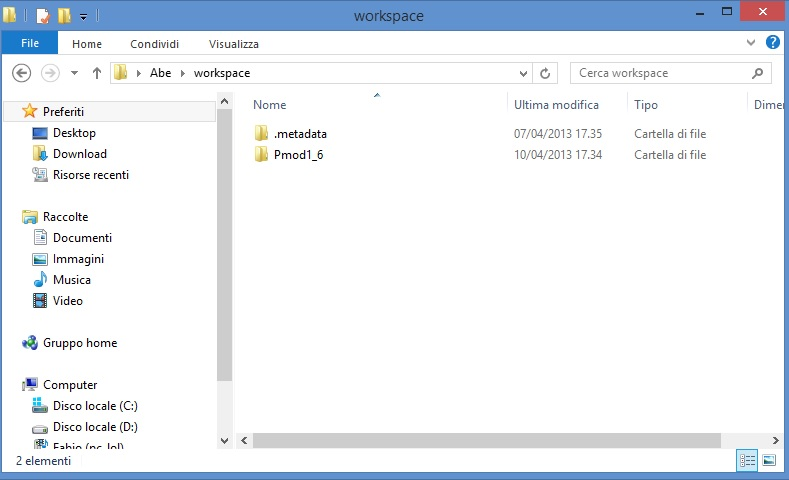

- start Codewarrior. Select "workspace" as in default window and click OK. 

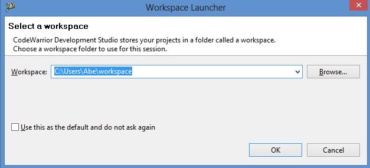

Now we could see the welcome window of Codewarrior Developement Suite

.. image:: _static/pmod3_welcome.jpg 

*maybe will open firewall popup as below*

.. image:: _static/pmod_fire.jpg 

if yes, left-clik on **enable access** and proceed

- close the welcome window by clicking '**X**' in the Welcome tab 

.. image:: _static/pmod_close_welcome.jpg 

Now we can see the Codewarrior main window

.. image:: _static/pmod_main.jpg 

Codewarrior is ready to import the project

**Pmod FIRMWARE IMPORT**

- Select File --> Import and click

.. image:: _static/pmod_import.jpg 

- in the next tab select "Existing Project into Workspace" and click "NEXT"

.. image:: _static/pmod_space.jpg 

- in the next window make the following step

| 1 - click on **Brouse** button.
| 2 - select folder "Pmod1_6" as below.
| 3 - click on OK button.

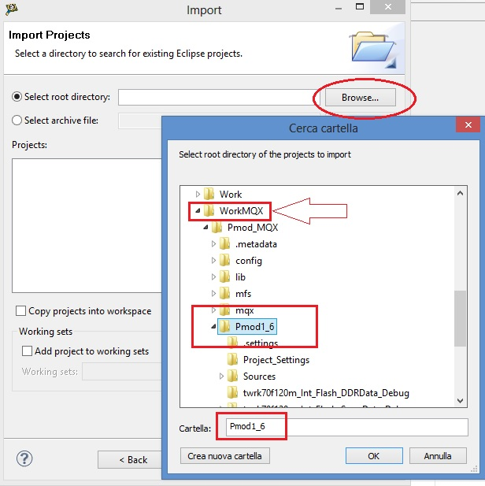

- select checkbox "Pmod1_6(C:\\User\\ *my_foder_name* \\workspace\\Pmod1_6) and "Copy projects into workspace"
- click "Finish"

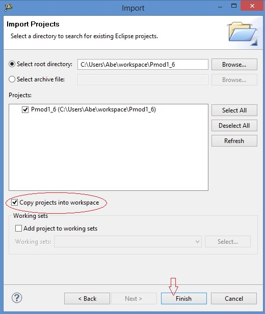

**How to build Brooklyn Board FW**

- see Codewarrior Project tab an selec the project "Pmod1_6", right-clik over, select "Clean Project" an clik

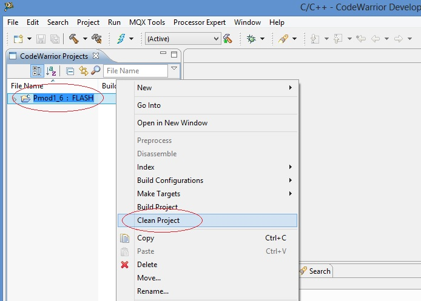

when process finish, see at hammer icon and click right arrow: in the tab you can see "1 FLASH" checked

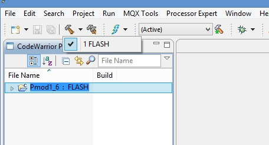

now click single-hammer icon to build entire project

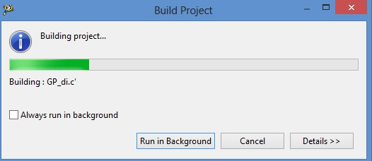

See the "problems" tab. There are 2 warnings derived from original project. They have no functionallity effects.

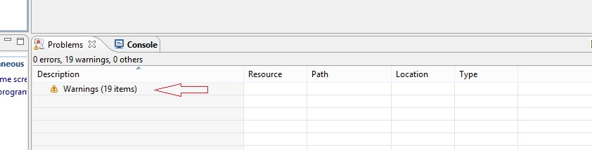

see the bug icon and click right arrow, select "Debug configurations" and click

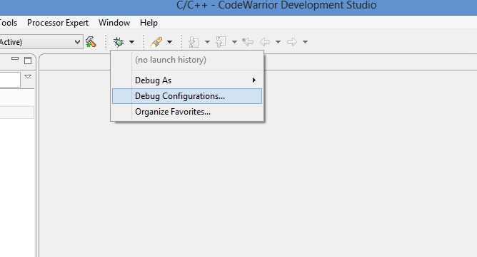

Debug Configurations tab will open

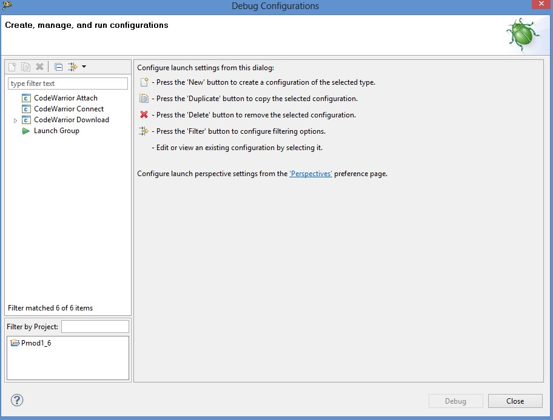

expand Codewarrior Download, select "Pmod1_FLASH_PnE U-Multilink" an click. Now we see 

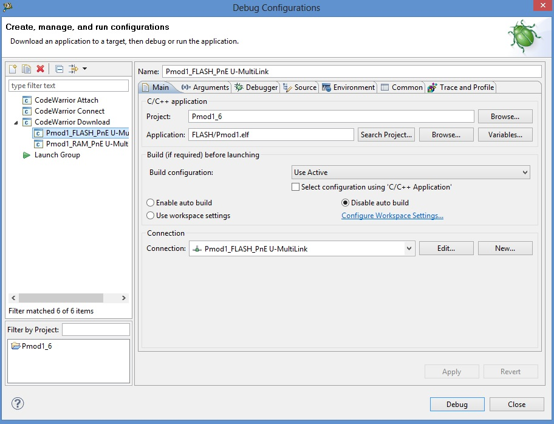

click on "Debug" button and wait

*maybe will open firewall popup as below*

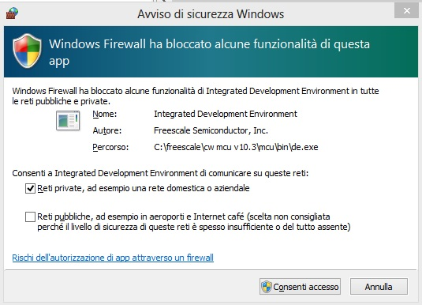

*if yes, left-clik on* **enable access** *and proceed*

during firmware download this tab will open 

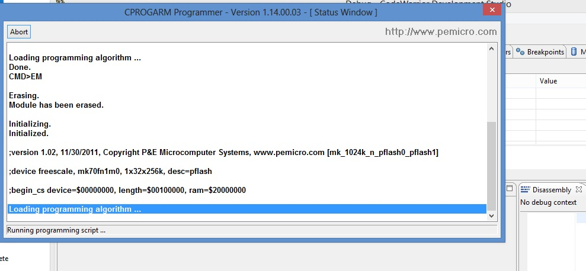

and when download finish you see the main debug windows of Codewarrior

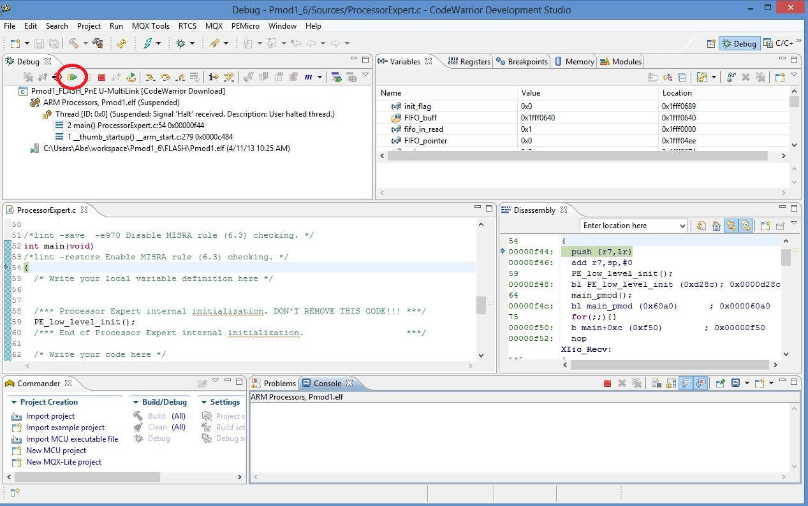

to start program you can press "F8" or click on Icon red-circled in image above

**NOTE: for full Codewarrior functionallity please refer to Freescale Official Guide**

`download here Codewarrior Guide <http://cache.freescale.com/files/soft_dev_tools/doc/support_info/Getting_Started_Guide_for_Microcontrollers.pdf?fsrch=1&WT_TYPE=Supporting%20Information&WT_VENDOR=FREESCALE&WT_FILE_FORMAT=pdf&WT_ASSET=Documentation&sr=11>`_

Running Brooklyn Board FW
-------------------------

When you start program, in terminal window you can see for few seconds this screen

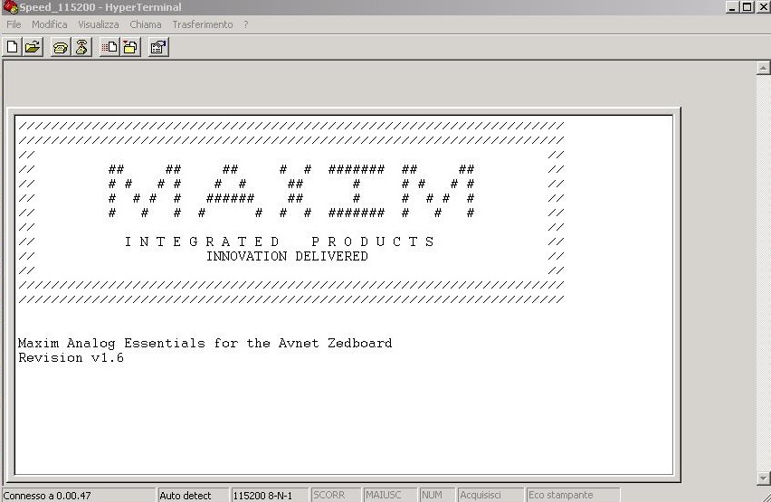

and after you can see the main menu

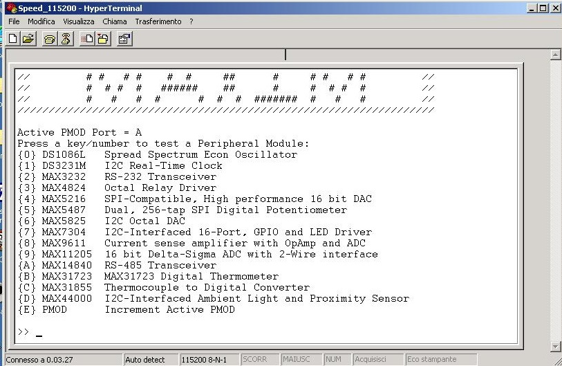

| Now select device menu (typing selection key in the terminal window) and follow menu option to test device.
| **It is strongly recommended to change or insert Pmod Modules when Tower System is off (without power).** 
| Then, turn off the power by disconnecting the Mini USB B-type cable, remove device (if present) and insert new module in properly connector. 
| Turn on the power by plug the Mini USB B-type cable. The program will restart. Follow same steps used before to test new device

