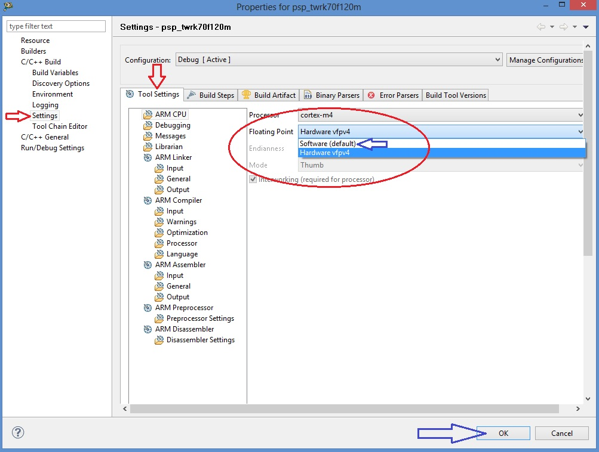
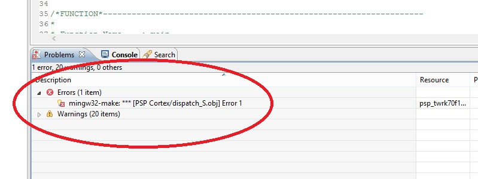
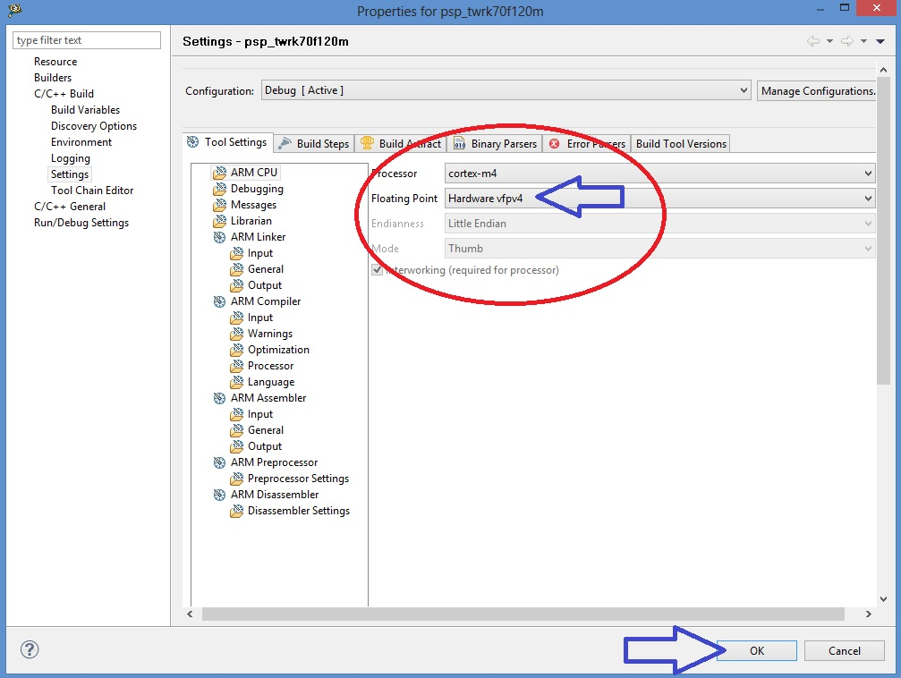
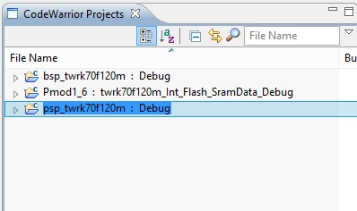
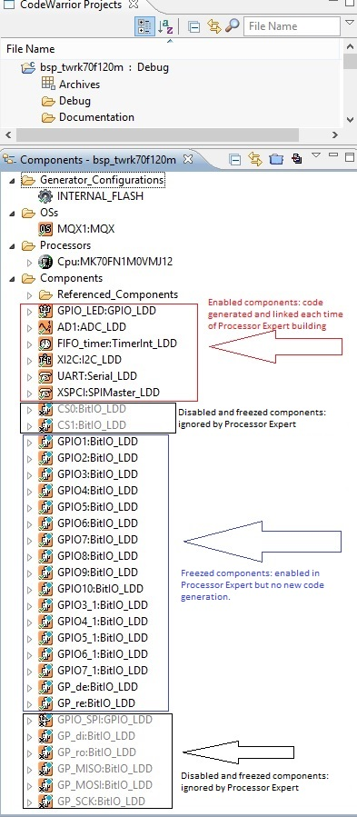
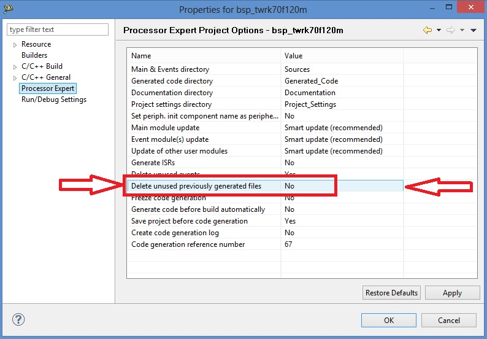

Tips and Tricks
***************

At the date of issue of this firmware version there are some care in the use of Cadewarrior 10.3. If you would make changes in BSP or PSP library or in Processor Expert components, please take care the following remarks.
We know that it's just released a new Codewarrior version (10.4) but we have no tested the functionality of this project inside this revision.

**Printf Floating Point settings**

In order to see temperature value of MAXIM Pmod DS3231M, MAX31723 and MAX31855 printf function need to be improved with floating poing features.  Settings of this functionallity are included in PSP library.

For the normally use of this project, there is no reason to clean and rebuild PSP library. If you need to make this operation, there is a possibility to have some truobles with **printf** function whit floating point variables. If it occours, there is a trip for rebuild this library without floating point failure.

- **be very careful to the next steps**

| 1 - Select PSP properties (right-click on project)
| 2 - Select C/C++ Build --> Settings
| 3 - Select and set Floating Point **"Software (default)"**
| 4 - Click **OK** button to confirm selections

5 - Right click on PSP project, select build. When finished, in the Problems Windows there is one error. Don't care it and proceed with following steps 6-10.

| 6 - Select PSP properties (right-click on project)
| 7 - Select C/C++ Build --> Settings
| 8 - Select amd set Floating Point **"Hardware vfpv4"**
| 9 - Click **OK** button to confirm selections

10 - Right click on PSP project, select build. When finished, in the Problems Windows there is NO error

BSP library are now builded and ready for the project without any error

**Cautions for Processor Expert suite**

Pmod project is developed using HAL driver generated using Processor Expert suite. The suite is located inside BSP library. 

**Brief summary of Processor Expert components settings**

See the figure below.

1- Components red framed are standard Processor Expert component. It's possible to make changes at any time. Code generation takes changes and make new files each time.

2- Components black framed are ignored by Code generation and linker. This mode can be used when you like to use same pins alternately for UART and GPIO function. With Processor Expert using more than one components for same pin make errors in code generation. To make this, you can enable first components using pins, generate code, disable components and enable the second one for new code generation. The result is tha you have more source code using same pins.

3- Component blue framed. Component "freezed". Code generation is disabled. This is because Processor Expert in Codewarrior 10.3, in BitIo or BitsIO components, don't add mqx include files during code generation. The result of this is a general linker error during build of BSP library. If yuo make changes or add a new one, yuc must add "manually" the needed include file "mqx.h" in component code (.h file) and disable code generation.

**ADDING DEFINITION IN PE_LDD FILES**

When you make any changes os adds in Processor Expert components, you must proceed with new code generation. After this, because of disabled components in project, some manual adding are needed in PE_LDD.h and PE_LDD.c files (see folder Generated_Code in BSP project)
Look at **PE_LDD add.txt** in project folder (C:\\Pmqx). You must copy definition inside this file into PE_LDD.h as image below:

::

 ** ===========================================================================
 ** LDD component ID specifying the component instance in the project. This ID
 ** is used internally as an index to the array of LDD device structures.
 ** ===========================================================================
 */
 #define PE_LDD_COMPONENT_GPIO_LED_ID             0x00U
 #define PE_LDD_COMPONENT_AD1_ID                  0x01U
 #define PE_LDD_COMPONENT_TU1_ID                  0x02U
 #define PE_LDD_COMPONENT_FIFO_timer_ID           0x03U
 #define PE_LDD_COMPONENT_XI2C_ID                 0x04U
 #define PE_LDD_COMPONENT_UART_ID                 0x05U
 #define PE_LDD_COMPONENT_XSPCI_ID                0x06U
 #define PE_LDD_COMPONENT_GPIO1_ID                0x07U
 #define PE_LDD_COMPONENT_GPIO2_ID                0x08U
 #define PE_LDD_COMPONENT_GPIO3_ID                0x09U
 #define PE_LDD_COMPONENT_GPIO4_ID                0x0AU
 #define PE_LDD_COMPONENT_GPIO5_ID                0x0BU
 #define PE_LDD_COMPONENT_GPIO6_ID                0x0CU
 #define PE_LDD_COMPONENT_GPIO7_ID                0x0DU
 #define PE_LDD_COMPONENT_GPIO8_ID                0x0EU
 #define PE_LDD_COMPONENT_GPIO9_ID                0x0FU
 #define PE_LDD_COMPONENT_GPIO10_ID               0x10U
 #define PE_LDD_COMPONENT_GPIO3_1_ID              0x11U
 #define PE_LDD_COMPONENT_GPIO4_1_ID              0x12U
 #define PE_LDD_COMPONENT_GPIO5_1_ID              0x13U
 #define PE_LDD_COMPONENT_GPIO6_1_ID              0x14U
 #define PE_LDD_COMPONENT_GPIO7_1_ID              0x15U
 #define PE_LDD_COMPONENT_GP_de_ID                0x16U
 #define PE_LDD_COMPONENT_GP_re_ID                0x17U
   
 #define PE_LDD_COMPONENT_CS0_ID              	  0x18U    <-- added definition
 #define PE_LDD_COMPONENT_CS1_ID                  0x19U    <-- added definition
 #define PE_LDD_COMPONENT_GP_di_ID                0x1AU    <-- added definition
 #define PE_LDD_COMPONENT_GP_ro_ID                0x1BU    <-- added definition
 #define PE_LDD_COMPONENT_GPIO_SPI_ID             0x1CU    <-- added definition
 #define PE_LDD_COMPONENT_GP_MISO_ID              0x1DU    <-- added definition
 #define PE_LDD_COMPONENT_GP_MOSI_ID              0x1EU    <-- added definition
 #define PE_LDD_COMPONENT_GP_SCK_ID               0x1FU    <-- added definition
 /*

| You must change also PE_LDD.c: 
| definition of LDD_TDeviceData *PE_LDD_DeviceDataList[24]* changed to **LDD_TDeviceData *PE_LDD_DeviceDataList[32]**
| added 8 row of "NULL," in structure definition.
| The result of changes is show in figure below

::

 /*
 ** ===========================================================================
 ** Array of initialized device structures of LDD components.
 ** ===========================================================================
 */
 LDD_TDeviceData *PE_LDD_DeviceDataList[32] = {
    NULL,
    NULL,
    NULL,
    NULL,
    NULL,
    NULL,
    NULL,
    NULL,
    NULL,
    NULL,
    NULL,
    NULL,
    NULL,
    NULL,
    NULL,
    NULL,
    NULL,
    NULL,
    NULL,
    NULL,
    NULL,
    NULL,
    NULL,
    NULL,
    NULL,
    NULL,
    NULL,
    NULL,
    NULL,
    NULL,
    NULL,
    NULL
  };

**IMPORTANT SETTING**
To obtain functionallity as described above, you must go to BSP Properties --> Processor Expert Option and set "Delete unused previously generated file = NO". See figure below

**NOTE: on further revisions of Codewarrior these tips have to be checked and verified**
